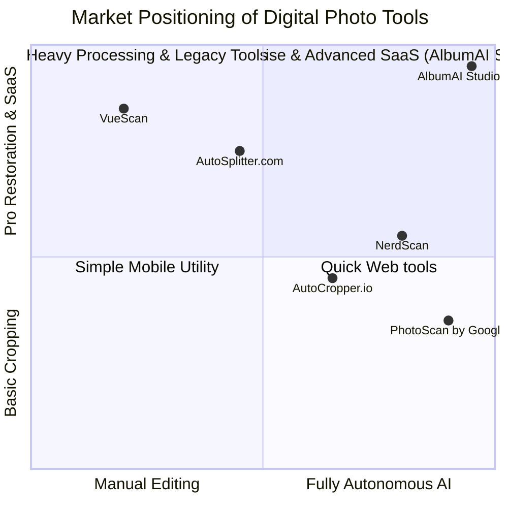

# Deep Market Research & Competitive Analysis: AlbumAI Studio

An exhaustive study of modern digital photo crop, splitting, restoration, and preservation tools to define the ultimate target state for **AlbumAI Studio v2.0**.

---

## 📊 Overview of the Competitors

### 1. AutoCropper.io
* **Platform:** Web (Browser-based, cloud API fallback)
* **Target Audience:** Non-technical consumers wanting instant crops of scanned pages.
* **Core Mechanisms:** OpenCV thresholding / basic contours in browser WASM.
* **UX/Aesthetics:** Extremely clean, modern, dark-by-default, glassmorphism, pricing tables, instant feedback.
* **Strengths:** 
  * Frictionless entry: no login required to test.
  * Very fast for simple high-contrast scans.
  * Beautiful visual hierarchy.
* **Weaknesses:**
  * Fails completely when photos overlap or have matching backgrounds to the page.
  * Lacks restoration features, upscaling, metadata retention, and semantic organization.
  * Contours often chop off light-colored edges of photos.

### 2. AutoSplitter.com
* **Platform:** Windows Desktop (Legacy C++ / .NET)
* **Target Audience:** Collectors, genealogists, vintage hobbyists with massive flatbed scans.
* **Core Mechanisms:** Traditional computer vision (edge detection, hough lines, color variance analysis).
* **UX/Aesthetics:** Windows-classic legacy desktop GUI. Highly functional but visual appeal is outdated.
* **Strengths:**
  * **Batch Review Workflow:** Sidebar with thumbnail progress, red-highlighted selection frames around scanned pictures, and high-efficiency keybindings.
  * **Color Calibration:** Built-in auto white-balance, manual crop fine-tuning, scanner color correction profiles.
* **Weaknesses:**
  * High barrier to entry (requires desktop installation, Windows only).
  * Lacks AI capabilities (no face clustering, no semantic grouping, no zero-shot object detection).
  * Interface feels complex and dated to modern users.

### 3. NerdScan
* **Platform:** Python CLI / Local Script
* **Target Audience:** Privacy-centric developers, advanced users, archivers.
* **Core Mechanisms:** Grounding DINO + local PyTorch inference.
* **UX/Aesthetics:** Terminal-rich output with progress bars, emoji logs, and fast processing statistics.
* **Strengths:**
  * 100% private: no data leaves the computer.
  * Zero-shot text prompt detection handles arbitrary objects (polaroids, documents, postcards).
  * Direct filesystem-to-filesystem output.
* **Weaknesses:**
  * Hard to use for non-developers (requires console, virtualenv setup).
  * No visual preview before executing crops.
  * Lacks modern batch review controls.

### 4. VueScan
* **Platform:** Desktop (Multi-platform legacy utility)
* **Target Audience:** Professional archivists, photographers, advanced scanner users.
* **Core Mechanisms:** Direct scanner driver emulation, hardware-level calibration, raw TIFF file handling.
* **UX/Aesthetics:** Windows/macOS native toolkit, extremely feature-dense and utilitarian.
* **Strengths:**
  * Flawless hardware integration (supports over 7,400 scanners).
  * Precise color profiles (ICC), infrared scratch removal (ICE).
* **Weaknesses:**
  * Extremely steep learning curve.
  * No modern AI/ML features; strictly an interface for optical scanning hardware.

### 5. PhotoScan by Google
* **Platform:** Mobile (Android & iOS)
* **Target Audience:** Casual mobile users scanning physical prints with their phone cameras.
* **Core Mechanisms:** Multi-angle capture, feature matching, glare removal, perspective warping.
* **UX/Aesthetics:** Sleek, dynamic camera overlay, floating dots directing the user, instant background processing.
* **Strengths:**
  * Glare reduction is world-class (combines multiple frames taken at different angles).
  * Highly accessible: anyone can use it anywhere.
* **Weaknesses:**
  * Designed for single photos at a time, not for batch flatbed scans containing multiple photos.
  * Heavy loss of quality due to mobile camera lenses and compression.
  * No batch review or structured directory export.

---

## 💡 Strategic Positioning for AlbumAI Studio v2.0

To achieve absolute commercial superiority, **AlbumAI Studio v2.0** fuses the strengths of all these products while eliminating their limitations:

1. **AutoCropper's Sleek Web SaaS Aesthetics:** Beautiful React/Next.js interface with dark mode, HSL tailored gradients, transparent pricing, and smooth drag-and-drop animations.
2. **AutoSplitter's Batch Review Efficiency:** A dedicated `/review` screen featuring a sidebar of scans, interactive red bounding boxes (`--review-frame`), manual corrections on canvas, and instant crop previews.
3. **NerdScan's High-Precision AI Model:** Local or cloud-routed Grounding DINO zero-shot object detection that handles overlap, vintage borders, and low-contrast images flawlessly.
4. **Professional Restoration Pipeline:** Multi-level upscale (Real-ESRGAN + GFPGAN face restoration) and advanced color revitalization (white balance, CLAHE, orange-cast removal for acid-deteriorated paper).
5. **Ultra-Level Organization:** Automated face clustering (InsightFace + HDBSCAN), semantic categorization (CLIP search), and seamless integration with Google Photos.

---

## 🛠️ Key Takeaways for Design and Technical Implementation

* **BBox Frame Customization:** Bounding boxes must have high contrast, draggable corner handles, and a signature red border (`#DC2626`) matching the user-validated visual feedback of high-performance tools.
* **SaaS Tier Optimization:** The "Free" tier operates contour-based or lightweight thresholding on client-side or cheap API nodes, whereas the "Pro/Ultra" tier unlocks the GPU-backed ML pipeline (DINO + Real-ESRGAN).
* **Privacy Controls:** Clear messaging to the user that files are either processed locally (desktop version) or safely discarded after 24 hours on the cloud version.
