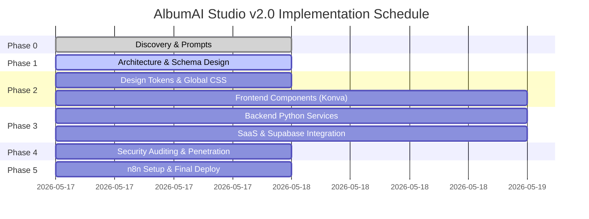

# AlbumAI Studio v2.0 — Implementation Plan

Execution milestones and timeline for delivery of the full-stack SaaS platform.

---

## 🏁 Milestones & Timeline

---

## 🛠️ Detailed Tasks & Ownership

### Milestone 1: Foundation (Architecture & DB)
* **Goal:** Establish system schema, folders, and core database tables.
* **Tasks:**
  * Document architectures and schemas (`senior-architect.md`, `supabase migrations`).
  * Verify API health check routing.

### Milestone 2: UI Experience (Next.js & Styling)
* **Goal:** Launch the landing page, Pricing Tables, and Review Canvas.
* **Tasks:**
  * Configure premium tailwind theme and global styling sheets.
  * Construct `UploadDropzone`, `PricingTable`, and `ReviewSidebar`.
  * Embed Konva Canvas for box resizing.

### Milestone 3: AI Engine & Pipelines (Python backend)
* **Goal:** Unify DINO detection, Real-ESRGAN upscales, and Color Revitalizer.
* **Tasks:**
  * Write `services/retoucher.py` for advanced color revitalization.
  * Connect Next.js APIs to the FastAPI backend.
  * Integrate face clusters and CLIP search.

### Milestone 4: Security Validation & Automation
* **Goal:** Pentest manual runs, add Supabase RLS, and deploy n8n.
* **Tasks:**
  * Run static scans and write the final Security Audit.
  * Deploy docker-compose with Redis and Celery.
