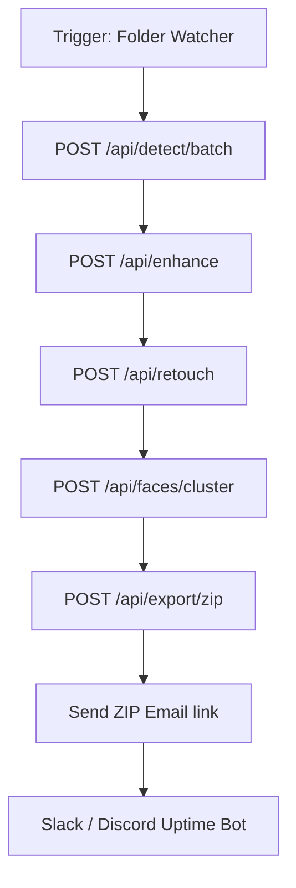

# n8n Workflow Auditor Architecture

This document specifies the system architecture for auditing and validating automated **n8n** pipelines within the **AlbumAI Studio** ecosystem, ensuring extreme security, uptime, and compliance.

---

## 📊 Workflow Topologies



---

## 🛡️ Auditor Controls (Audit Checklist & Rules)

To prevent security breaches, memory leaks, and silent failures inside n8n workflow nodes, the auditor verifies:

### 1. Webhook Authentication
* **Rule:** Every Webhook Trigger node in n8n must require basic authentication (`N8N_BASIC_AUTH_USER` / `N8N_BASIC_AUTH_PASSWORD`) or use a shared secret in the query parameter (e.g. `?token=...`).
* **Audit Check:** Scan workflow JSON configurations for empty `authentication` fields in Webhook triggers.

### 2. Error Handling & Circuit Breaking
* **Rule:** Every API request node must have "On Error" parameters set to "Continue" and route the exception to a standardized **Error Handler Notification Node** instead of silently halting execution.
* **Audit Check:** Ensure a `OnError` routing is present to send alerts to the Slack/Sentry webhooks.

### 3. Data Sanitization & Leak Prevention
* **Rule:** Temporary local files created by the folder watcher or PDF downloader must be immediately cleared after crop execution.
* **Audit Check:** Ensure a cleanup node exists at the end of the execution stream.

---

## 📈 Audit Reporting Format
Workflows must generate unified audit trails sent to Sentry/Prometheus:
```json
{
  "workflow_id": "watch_folder",
  "audited_at": "2026-05-17T02:49:00Z",
  "status": "SECURE",
  "checks": {
    "auth_active": true,
    "error_handling_mapped": true,
    "pii_leak_risk": "none"
  }
}
```
