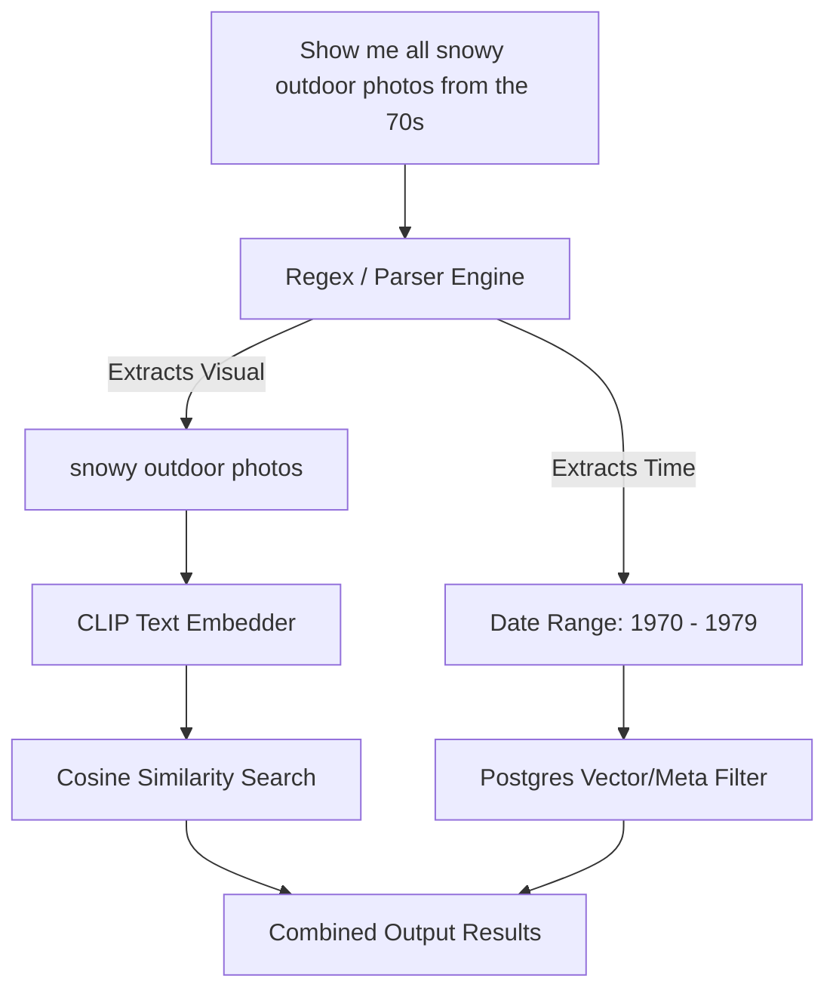

# Prompt Engineering Specifications: AlbumAI Studio

Strict guidelines and prompt patterns to optimize **Grounding DINO** (Zero-Shot Object Detection) and **OpenCLIP** (Zero-Shot Classification & Search) in **AlbumAI Studio v2.0**.

---

## 🎯 Grounding DINO Prompts (Zero-Shot Bounding Box Detection)

Grounding DINO is highly sensitive to text tokenization, casing, punctuation, and linguistic structure. The following specifications ensure maximum recall and precision during scan splitting.

### 1. Mandatory Prompt Pre-processing
Before sending a prompt to the model, the backend must apply these transformation rules:
1. **Force Lowercase:** Convert the entire prompt string to lowercase.
2. **Remove Double Spaces:** Standardize token distance.
3. **Punctuation Ending:** The prompt **must** end with a trailing period (`.`). Without it, attention maps fail to resolve token boundaries, leading to degraded box coordinates.

```python
# Required Python normalization function
def normalize_dino_prompt(prompt: str) -> str:
    prompt = prompt.lower().strip()
    if not prompt.endswith("."):
        prompt += "."
    return " ".join(prompt.split())
```

### 2. High-Performance Grounding Prompts

| Detection Target | Optimized Prompt | Why It Works |
|---|---|---|
| **Standard Photo Albums** | `"an old photo. a picture. a photograph."` | Provides multiple synonyms to trigger distinct feature map weights. |
| **Polaroids** | `"a polaroid photo with white borders. a vintage snapshot."` | Targets polaroid-specific visual structures (wide lower margin). |
| **Trading Cards** | `"a trading card. a baseball card. a cardboard game card."` | Emphasizes texture (cardboard) and card formats. |
| **Postcards (Backside)** | `"a vintage postcard. handwritten text on card. postmark stamp."` | Instructs the model to attend to ink and circular postmarks. |
| **Faded Prints** | `"a faded picture. an old print. a paper photo."` | Handles low-contrast edges. |

---

## 🖼️ OpenCLIP Prompts (Zero-Shot Classification & Event Labeling)

CLIP aligns images with textual descriptions in a shared embedding space. We structure classification candidates using rich templates to prevent "domain mismatch" and maximize categorization accuracy.

### 1. Template Engineering (Visual Context Enclosing)
Never use raw single-word labels like `"beach"`, `"wedding"`, or `"birthday"`. Instead, wrap candidates in contextual templates to yield robust cosine similarity scores.

```python
# Context wrap patterns
CLASSIFICATION_TEMPLATES = [
    "a photo of a {}",
    "a photograph captured during a {}",
    "a vintage picture of a {}",
    "an old photo showing a {}",
    "a classic family scene of a {}"
]
```

### 2. Standardized Scene/Event Taxonomy

Use the following mapped labels for Zero-Shot Classification during event grouping:

```python
SCENE_TAXONOMY = {
    "birthday party": ["birthday party", "kids birthday", "birthday celebration"],
    "wedding": ["wedding ceremony", "marriage celebration", "wedding reception"],
    "vacation": ["family vacation", "road trip", "travel snapshot"],
    "christmas": ["christmas celebration", "christmas tree", "holiday gathering"],
    "beach": ["sandy beach", "ocean seaside", "beach vacation"],
    "portrait": ["studio portrait", "individual portrait", "close-up face photo"],
    "landscape": ["mountain landscape", "forest scenery", "outdoor nature"],
    "sports": ["sports game", "athletic match", "outdoor sport event"],
    "graduation": ["graduation ceremony", "diploma celebration", "school graduation"],
    "family dinner": ["family dinner table", "thanksgiving dinner", "meal gathering"]
}
```

---

## 🔍 Semantic Search Prompt Patterns

To enable natural queries like *"Show me all snowy outdoor photos from the 70s"*, search queries undergo structured parsing to partition temporal and visual vectors.

### Query Decomposition Pipeline


