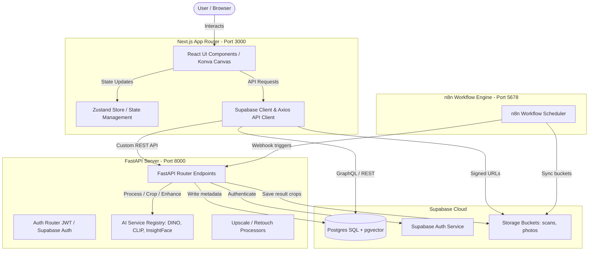
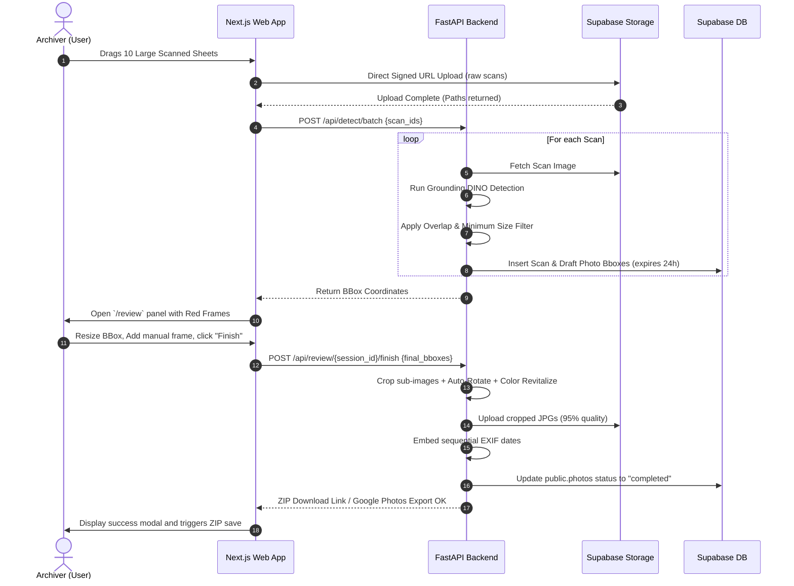

# Full-Stack System Architecture: AlbumAI Studio v2.0

Comprehensive architectural mapping of the AlbumAI Studio ecosystem.

---

## 🏛️ C4 Container Diagram

---

## 💾 Core Pipeline Workflow

---

## 🔒 Security Architecture (OWASP Top 10 Alignments)

- **A1: Broken Access Control:** Every table includes **Row Level Security (RLS)** in Postgres checking `auth.uid() = user_id`.
- **A2: Cryptographic Failures:** High-value photos stored with short-lived **Signed URLs** (expire in 15 minutes). JWTs rotation active.
- **A3: Injection:** SQLAlchemy ORM parameters are bound implicitly to block SQL injection. BBox coordinates validated by Pydantic ranges `[0.0, 1.0]`.
- **A5: Security Misconfiguration:** Strict CSP headers, HSTS preloaded, CORS whitelisted strictly to Vercel production domains.
- **A9: Security Logging:** Structlog redacts PII like user emails and IDs automatically from console prints and logs.
